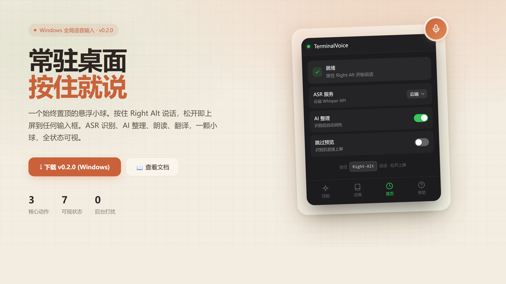
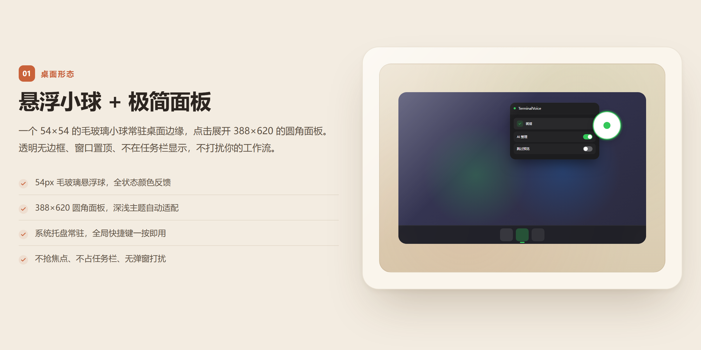
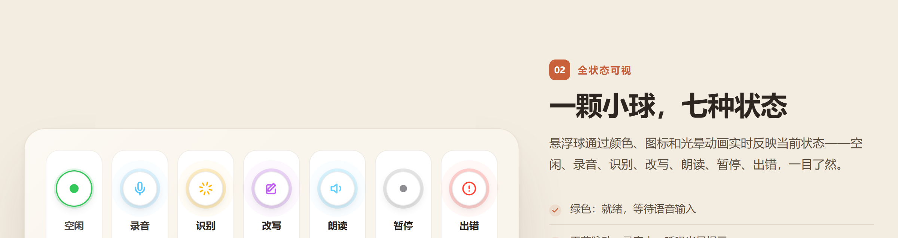
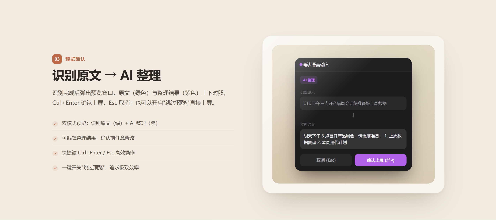
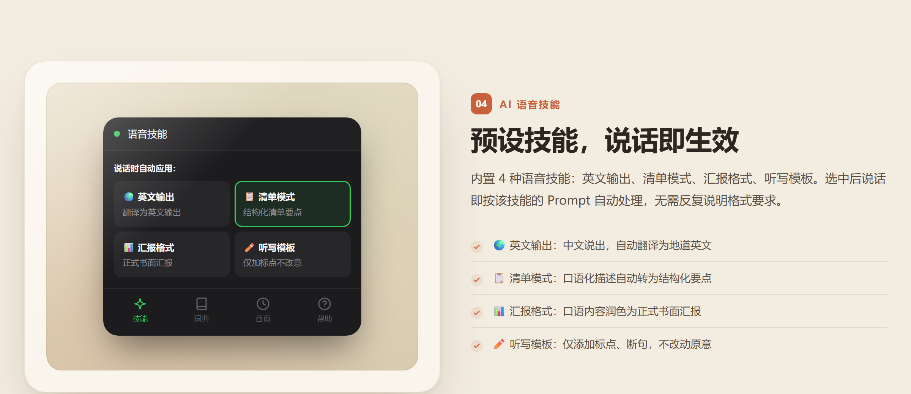
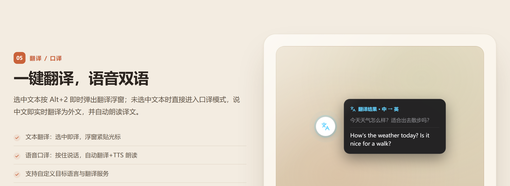
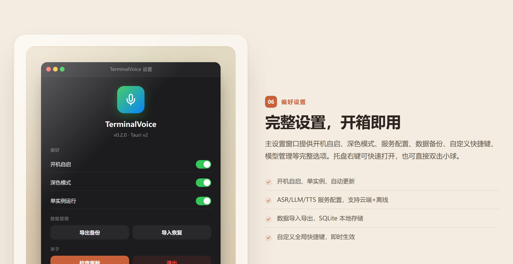

# TerminalVoice

> Windows 平台常驻全局语音输入桌面工具 — 桌面悬浮小球 + 极简面板，按住说话，松开上屏。


[](https://lucan6290.github.io/TerminalVoice/)

---

## 项目简介

TerminalVoice 是一款 Windows 桌面端的全局语音输入工具。以一个始终置顶的 **48x48 悬浮小球**（64x64 透明窗口）常驻桌面，配合 **极简圆角面板**，提供三大核心能力：

- 🎙️ **说**（Right Alt）：按住说话 → ASR 语音识别 → 可选 AI 整理 → 直接注入到当前光标位置
- 🔊 **听**（Alt+1）：选中文字 → TTS 朗读
- 🌐 **译**（Alt+2）：选中翻译 / 语音口译

设计理念：不侵入原软件、不自动执行命令、保持"输入→确认→发送"的习惯流程。所有数据本地保存，音频仅发送至用户自选的 ASR 服务商。

---

## UI 预览



### 桌面常驻形态



始终置顶的 54×54 毛玻璃悬浮球常驻桌面，点击展开 388×620 的极简圆角面板。透明无边框、不在任务栏显示，不遮挡工作区域。

### 悬浮球 · 7 种状态



通过颜色、图标与光晕动画实时反馈当前状态——空闲（绿点）、录音（天蓝麦克风呼吸光）、识别（琥珀加载）、改写（紫色魔杖）、朗读（青色音量）、暂停（灰点）、出错（红色感叹号）。

### 预览确认 · 识别原文 → AI 整理



识别完成后弹出预览窗口，原文（绿色）与 AI 整理结果（紫色）上下对照。Ctrl+Enter 确认上屏，Esc 取消；也可以开启"跳过预览"直接上屏。

### AI 语音技能 · 说话即生效



内置 4 种语音技能：英文输出、清单模式、汇报格式、听写模板。选中后说话即按该技能的 Prompt 自动处理，无需反复说明格式要求。

### 翻译 / 口译 · 一键双语



选中文本按 Alt+2 即时弹出翻译浮窗；未选中文本直接进入口译模式，说中文即实时翻译为外文，并自动 TTS 朗读译文。

### 主设置窗口



提供开机自启、深色模式、单实例、ASR/LLM 服务配置、数据备份/恢复、自定义快捷键、检查更新与退出等完整偏好设置。

---

## 当前状态

项目处于 **v0.1.0** 阶段，浮球方案三窗口体系已完整实现：

- ✅ 前端三窗口 UI 完整（悬浮球 + 面板 + 主设置窗口）+ 设计系统（Tailwind v4）
- ✅ 后端核心功能已实现：全局热键（运行时可配、热重载）、麦克风录音（cpal 16kHz/16bit/mono + rubato 重采样）、云端 ASR（WinHTTP multipart / OpenAI Whisper 兼容）、LLM 流式改写/翻译/技能（SSE）、TTS 朗读（Windows SAPI）、文本注入（enigo + 剪贴板回退）、选中文本捕获、系统托盘、自动更新、DPAPI 密钥加密、SQLite 持久化、VAD 能量静音检测、模型管理（HuggingFace 下载 + SHA256 校验）、开机自启、单实例、数据备份/恢复、热键自定义
- ✅ 32 个 IPC 命令 + 17 个事件已联通前后端
- ✅ 语音技能系统：4 个预设技能（英文输出/清单模式/汇报格式/听写模板）
- ✅ 中英双语 i18n（约 290 条 UI 文案）
- 🟡 离线 ASR（Whisper）推理引擎骨架已搭，`transcribe()` 尚未接入实际模型
- 📋 详见 [docs/CODE_MAP.md](docs/CODE_MAP.md) 了解每个模块的完整状态

---

## 快速开始

### 环境要求

- **Rust** >= 1.85 (stable)
- **Node.js** >= 22 LTS
- **pnpm** >= 10（推荐 corepack 启用）
- **Visual Studio Build Tools 2022**（C++ 桌面开发 + Windows 10/11 SDK）
- **WebView2 Runtime**（Win10 2004+ / Win11 已内置）

### 安装依赖

```bash
pnpm install
```

### 开发模式

```bash
# 仅前端开发（浏览器预览 UI，推荐做样式/组件时使用）
pnpm dev
# → http://localhost:1234

# 完整 Tauri 开发（前端 + Rust 后端）
pnpm tauri dev
```

### 测试

```bash
# 前端测试（Vitest + jsdom）
pnpm test

# Rust 测试
cd src-tauri && cargo test
```

### 构建

```bash
# 前端构建
pnpm build

# Tauri 打包（NSIS 安装包）
pnpm tauri build
```

---

## 技术栈

### 前端

| 类别 | 技术 |
| :--- | :--- |
| 框架 | React 19 + TypeScript 5.7 |
| 构建 | Vite 8（Rolldown + Oxc） |
| 样式 | Tailwind CSS v4（零配置，@theme 自定义 tokens） |
| 状态管理 | Zustand 5 + useSyncExternalStore（Toast） |
| 图标 | lucide-react |
| 测试 | Vitest 3 + Testing Library + jsdom |
| 桌面 API | @tauri-apps/api v2 + 插件（global-shortcut / clipboard-manager / dialog / shell / process / updater / autostart） |
| 国际化 | 自研中英双语（`lib/i18n.ts`，~290 条文案） |

### 后端

| 类别 | 技术 |
| :--- | :--- |
| 桌面框架 | Tauri v2（tray-icon + autostart + single-instance + shell + updater + process 插件） |
| 语言 | Rust 2021 edition |
| 数据库 | SQLite（rusqlite 0.40 bundled，WAL 模式） |
| 音频采集 | cpal 0.16 + rubato 0.16（重采样）+ hound（WAV 编码） |
| 文本注入 | enigo 0.6 + arboard 3.6（剪贴板回退） |
| 全局热键 | rdev（rustdesk fork，运行时可配置，支持热重载） |
| HTTP/网络 | windows-sys WinHTTP（云端 ASR multipart + 模型下载）+ reqwest（LLM SSE 流式） |
| LLM | 流式改写/翻译/技能自定义 prompt（SSE） |
| TTS | Windows SAPI（COM） |
| 加密 | Windows DPAPI（API Key 加密存储）+ zeroize 内存清零 |
| 其他 | VAD（RMS 能量静音检测）、SHA256 模型校验、zip 数据导出、dirs-next 路径 |

---

## 架构概览

```
┌──────────────────────────────────────────────┐
│            Windows 桌面环境                    │
│  ┌──────────┐  ┌──────────┐  ┌───────────┐  │
│  │ 终端 CLI  │  │ VS Code  │  │ 任意输入框 │  │
│  └─────┬────┘  └─────┬────┘  └─────┬─────┘  │
│        │              │              │        │
│        └──────────────┼──────────────┘        │
│                       │ SendInput/Clipboard   │
│                       ▼                       │
│  ┌─────────────────────────────────────┐      │
│  │       TerminalVoice 进程             │      │
│  │                                       │      │
│  │  ┌───────────────────────────────┐    │      │
│  │  │     Rust 后端 (src-tauri)     │    │      │
│  │  │  状态机 · 录音 · ASR · LLM   │    │      │
│  │  │  预处理 · SQLite · VAD · TTS  │    │      │
│  │  │  翻译 · 注入 · 热键 · 托盘    │    │      │
│  │  │  技能 · 模型管理 · 备份恢复   │    │      │
│  │  └───────────────┬───────────────┘    │      │
│  │                  │ Tauri IPC          │      │
│  │  ┌───────────────┴───────────────┐    │      │
│  │  │   WebView (React + Tailwind)  │    │      │
│  │  │  ┌───────┐   ┌────────────┐   │    │      │
│  │  │  │ 悬浮球 │   │  极简面板   │   │    │      │
│  │  │  └───────┘   └────────────┘   │    │      │
│  │  │  ┌──────────────────────┐     │    │      │
│  │  │  │ 主设置窗口（隐藏）    │     │    │      │
│  │  │  └──────────────────────┘     │    │      │
│  │  └───────────────────────────────┘    │      │
│  └─────────────────────────────────────┘      │
└──────────────────────────────────────────────┘
```

### 三窗口体系

| 窗口 | Label | 尺寸 | 特性 | 路由 |
| :--- | :--- | :--- | :--- | :--- |
| 悬浮小球 | `ball` | 64x64 | 透明、无边框、置顶、任务栏隐藏、可拖拽 | `#/ball` |
| 极简面板 | `panel` | 388x620 | 透明、无边框、置顶、任务栏隐藏 | `#/panel` |
| 主窗口 | `main` | 520x600 | 默认隐藏，设置/管理页（开机自启/深色模式/服务状态/关于） | `#/main` |

---

## 项目结构

```
src/                    # 前端 React + TS
├── windows/            # 三窗口入口
│   ├── ball/           # 悬浮小球（7 状态视觉 + 翻译浮窗）
│   └── panel/          # 面板（含 6 个 Tab + 预览弹窗 + 状态卡片）
│       └── tabs/       # Skill / Dict / History / Help / Service / Settings
├── components/ui/      # 原子 UI 组件（Toast/Toggle/SettingRow/ErrorModal/TranslatePopup/HotkeyRecorder/UpdateModal）
├── stores/             # Zustand 状态管理 + Toast store
└── lib/                # invoke 封装（32 命令）、事件（17 个）、类型、i18n 双语、工具

src-tauri/              # 后端 Rust
├── src/
│   ├── state.rs        # 5 状态机（Idle/Recording/Recognizing/Preview/Paused）
│   ├── tray.rs         # 系统托盘
│   ├── commands/       # Tauri IPC 命令（10 模块：audio/backup/config/dictionary/history/hotkey/model/preview/skills/updater）
│   └── services/       # 业务服务（24 模块：db/recorder/audio/asr/asr_cloud/asr_offline/hotkey/pipeline/llm/translate/tts/injector/clipboard/rewrite/vad/preprocess/secrets/skills/model_manager/events/app_context/paths/logging/backup）
└── tauri.conf.json     # 窗口/构建/权限配置

docs/                   # 项目文档（见下方）
```

---

## 文档

**全局文档（实时更新，描述当前代码状态）**：

| 文档 | 说明 |
| :--- | :--- |
| [AGENTS.md](AGENTS.md) | Agent 入口导航（AI 助手必看） |
| [docs/CODE_MAP.md](docs/CODE_MAP.md) | 代码地图 — 每个模块当前状态与缺口 |
| [docs/IPC_API.md](docs/IPC_API.md) | IPC 接口契约（32 invoke 命令 + 17 事件） |
| [docs/STATE_MACHINE.md](docs/STATE_MACHINE.md) | 应用状态机详解 |
| [docs/DESIGN_SYSTEM.md](docs/DESIGN_SYSTEM.md) | 设计 Tokens 与组件规范 |
| [docs/ASR_CONFIG_GUIDE.md](docs/ASR_CONFIG_GUIDE.md) | ASR 服务配置指南 |

**版本文档**：

| 目录 | 说明 |
| :--- | :--- |
| [docs/v0.3/](docs/v0.3/) | **v0.3（使用统计）** 规划文档：计划、数据模型、复用调研 |
| [docs/v0.2/](docs/v0.2/) | **浮球方案** 规划文档（已归档）：总计划、UI 需求、复用调研 |
| [docs/v0.1/](docs/v0.1/) | **v0.1（V1.1 单窗口方案）** 历史归档：PRD、架构、实施方案 |

---

## 链接

- 🌐 官网：https://lucan6290.github.io/TerminalVoice/
- GitHub：https://github.com/lucan6290/TerminalVoice
- 问题反馈：[Issues](https://github.com/lucan6290/TerminalVoice/issues)
- 安全漏洞：[Security Advisories](https://github.com/lucan6290/TerminalVoice/security/advisories/new)

---

## 致谢

本项目在产品思路、UI 设计与交互形态上，参考并借鉴了以下优秀开源项目，在此表示感谢：

- [**cc-switch**](https://github.com/farion1231/cc-switch) — 温暖奶油色营销页视觉风格的灵感来源
- [**clash-party (mihomo-party)**](https://github.com/mihomo-party-org/clash-party) — 桌面悬浮球常驻形态与透明窗口设计参考
- [**pometype**](https://github.com/ShiliuX-Team/pometype) — 全局语音/输入类工具的交互思路参考

感谢这些项目作者的开源贡献。

---

## Git 工作流

- 主分支 `main`，功能分支从 main 分出
- 提交信息遵循 Conventional Commits 中文规范（见 [CONTRIBUTING.md](CONTRIBUTING.md)）
- 默认本地提交，推送远程需明确确认

详见 [CLAUDE.md](CLAUDE.md)。

---

## 参与贡献

欢迎所有形式的贡献！无论你是想**提出一个好想法**、**反馈 Bug**、**改善 UI/交互**、**补充文档**，还是**直接提交代码**，都非常欢迎。

**你可以这样参与**：

- 💡 **想法/建议**：到 [Discussions](https://github.com/lucan6290/TerminalVoice/discussions) 开帖讨论，任何点子都欢迎（新功能、交互优化、体验细节……）
- 🐛 **Bug 反馈**：在 [Issues](https://github.com/lucan6290/TerminalVoice/issues) 提交，请带上复现步骤和系统版本
- 🧑‍💻 **提交代码**：Fork 本仓库 → 从 `main` 创建功能分支 → 提交 PR，建议先在 Issue/Discussion 中沟通大改动方向
- 📝 **文档/翻译**：错别字、表述优化、多语言支持，同样欢迎 PR
- 🎨 **UI/设计**：悬浮球/面板的视觉改进、动画细节、配色建议

开始之前建议先读 [AGENTS.md](AGENTS.md)（项目结构与约定）和 [docs/CODE_MAP.md](docs/CODE_MAP.md)（当前模块状态），能快速熟悉代码。每一份 PR 都会被认真 review 和合并，期待你的想法！

---

## License

[GPL-3.0](LICENSE)
